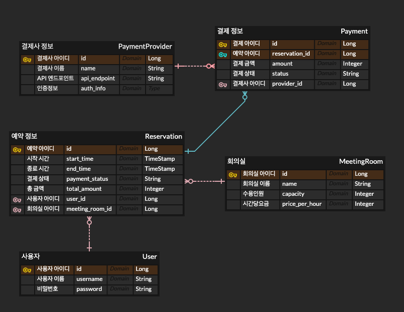
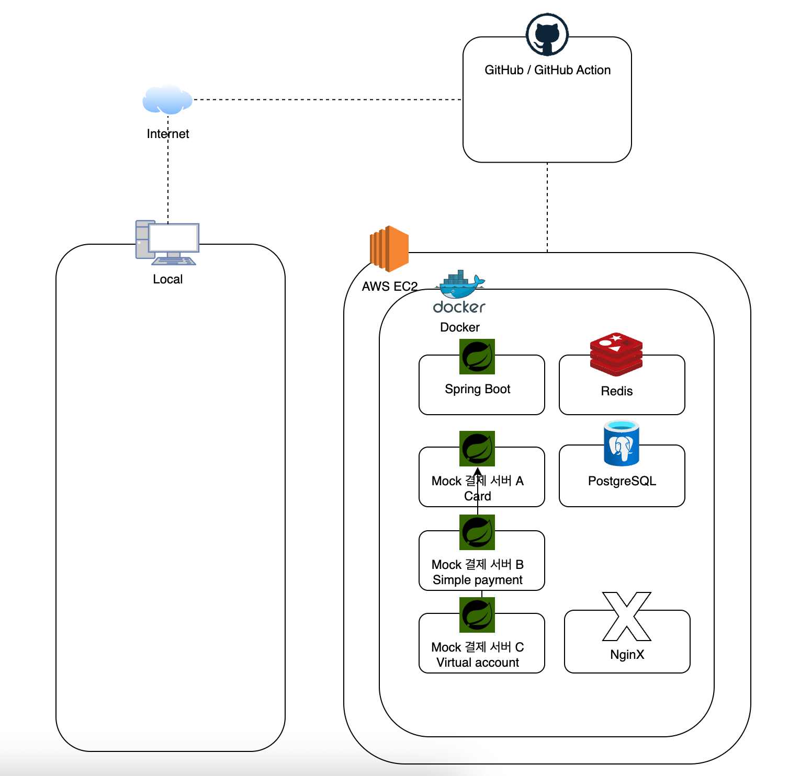

# 회의실 예약 시스템 API 서버

## 1. 프로젝트 개요

사내 회의실 예약을 위한 RESTful API 서버입니다.
사용자는 회의실을 조회하고, 원하는 시간을 예약 및 결제하며, 예약을 취소할 수 있습니다. 다양한 결제 수단을 지원하기 위해 결제 시스템을 추상화하여 설계했으며, 동시성 문제를 해결하여 데이터 정합성을 보장합니다.

## 2. 핵심 기능
### 2.2 필수 API 엔드포인트
-   **회의실 목록 조회**:  `GET /meeting-rooms`
-   **예약 생성/조회/취소 등 CRUD**
- **결제 처리**: `POST /reservations/{id}/payment`
- **결제 상태 조회**: `GET /payments/{paymentId}/status`
- **결제사별 웹훅 수신**: `POST /webhooks/payments/{provider}`
- **모든 API는 Swagger UI로 테스트 가능해야 함**
### 2.3 필요 API 엔드포인트

| 구분  | 내용        | Method   | API                            | Authorization |
|:----|:----------|:---------|:-------------------------------|:-----------|
 | 회의실 | 회의실 모두 조회 | `GET`    | `/meeting-rooms`               |            |
|     | 회의실 하나 조회 | `GET`    | `/meeting-rooms/{id}`          |            |
|     | 회의실 수정    | `PUT`    | `/meeting-rooms/{id}`          | admin      |
|     | 회의실 생성    | `POST`   | `/meeting-rooms`               | admin      |
|     | 회의실 삭제    | `DELETE` | `/meeting-rooms/{id}`          | admin      |
| 예약  | 예약 생성     | `POST`   | `/reservation`                 | user       |
|     | 예약 수정     | `PUT`    | `/reservation/{id}`            | user       |
|     | 예약 모두 조회  | `GET`    | `/reservation`                 |            |
|     | 예약 하나 조회  | `GET`    | `/reservation/{id}`            |            |
|     | 예약 취소     | `DELETE` | `/reservation/{id}`            | user       |
|     | 결제 처리     | `POST`   | `/reservation/{id}/payment`    | user       |
| 웹   | 결제사 별 웹훅  | `POST`   | `/webhooks/payments/{provider}` |           |


- 회의실
  - 생성
  - 


## 3. 기술 스택

| 구분            | 기술                             | 버전    |
| :-------------- |:-------------------------------|:------|
| **언어**        | Java                           | 17    |
| **프레임워크**  | Spring Boot                    | 3.4.8 |
| **데이터베이스**| PostgreSQL                     | 8.0+  |
| **ORM**         | Spring Data JPA                | -     |
| **API 문서화**  | Springdoc OpenAPI (Swagger UI) | 2.5.0 |
| **컨테이너**    | Docker, Docker Compose         | -     |
| **테스트**      | JUnit 5, Mockito               | -     |
| **빌드 도구**   | Gradle                         | -     |
 | **배포** | AWS| -     |
## 4. 실행 방법

### 4.1. 사전 요구사항

-   Docker 및 Docker Compose가 설치되어 있어야 합니다.
- 설치되지 않았다면 4.1.1 을 참고해 Docker를 설치할 수 있습니다.
### 4.1.1 Docker 설치하기
💻 Windows / macOS / Linux 사용자 공통

1. Docker Desktop 설치
    1.	https://www.docker.com/products/docker-desktop/ 접속
    2.	OS에 맞는 Docker Desktop 설치
    3.	설치 후 실행 (최초 설치 시 로그인 필요 – 무료 계정 생성 가능)

윈도우 사용자는 반드시 WSL2가 설치되어 있어야 합니다.

	•   설치 가이드: https://learn.microsoft.com/ko-kr/windows/wsl/install

### 4.1.2
macOS 터미널에서 설치하기 
```bash
brew install docker
brew install docker-compose
```

### 4.1.3 설치 확인
터미널 (cmd, powershell, 터미널 등)에서 아래 명령 실행
```
docker version
docker compose version
```
출력 예시
```
Docker version 28.0.4, build cb74dfc
Docker Compose version v2.34.0
```
### 4.2. 애플리케이션 실행
프로젝트 클론
```
git clone https://github.com/ByeongDoo-Han/wiseai-dev-meetingroom
```

디렉토리 이동 && 실행 권한 부여 && 프로젝트 빌드
```
cd wiseai-dev-meetingroom
chmod +x ./gradlew
./gradlew clean build
```

프로젝트 루트 디렉토리에서 아래 명령어를 실행하여 애플리케이션 서버와 데이터베이스를 한 번에 실행합니다.

```bash
docker-compose up --build
```

-   `--build` 옵션은 최초 실행 시 또는 코드 변경 사항이 있을 때 이미지를 새로 빌드하기 위해 사용합니다.

### 4.3. API 문서 확인

애플리케이션이 정상적으로 실행된 후, 웹 브라우저에서 아래 주소로 접속하여 Swagger UI를 통해 API 문서를 확인하고 직접 테스트할 수 있습니다.

-   **Swagger UI**: [http://localhost:8080/docs](http://localhost:8080/docs)

## 5. 테스트 실행 방법

프로젝트의 단위 테스트 및 통합 테스트를 실행하려면 아래 명령어를 사용합니다.

```bash
./gradlew test
```

## 6. 아키텍처 및 설계

### 6.1. 데이터베이스 모델 (ERD)



-   **MeetingRoom**: 회의실 정보 (id, name, capacity, price_per_hour)
-   **User**: 사용자 정보 (id, username, password)
-   **Reservation**: 예약 정보 (id, start_time, end_time, payment_status, total_amount, user_id, meeting_room_id)
-   **Payment**: 결제 정보 (id, provider_type, amount, status, external_payment_id, reservation_id)
-   **PaymentProvider**: 결제사 정보 (id, name, api_endpoint, auth_info)

## 7. 주요 설계 결정사항

### 7.1. 결제 시스템 추상화

-   **`PaymentGateway` 인터페이스**: `pay()`, `cancel()`, `getStatus()` 등 결제 관련 공통 기능을 정의합니다.
-   **`CardPaymentGateway`, `SimplePaymentGateway` 등**: 각 결제사 API 명세에 맞춰 `PaymentGateway`의 구현 클래스를 작성합니다.
-   **`PaymentService`**: 클라이언트의 요청(결제사 타입)에 따라 적절한 `Gateway` 구현체를 선택하여 결제 로직을 위임합니다. 이를 통해 새로운 결제사가 추가되더라도 기존 코드의 변경을 최소화할 수 있습니다.
-   **공통 응답 모델**: 각기 다른 결제사의 API 응답을 `PaymentResult`라는 공통 데이터 모델로 변환하여 시스템 내에서 일관되게 처리합니다.

### 7.2. 동시성 제어

-   **예약 중복 방지**: 데이터베이스의 비관적 락(Pessimistic Lock) 또는 낙관적 락(Optimistic Lock)을 사용하여 동일한 회의실/시간에 대한 동시 예약을 방지합니다. 특히 동시 요청이 많은 예약 시스템 특성을 고려해 비관적 락(`SELECT ... FOR UPDATE`)을 우선적으로 고려하여 데이터 정합성을 강력하게 보장합니다.
-   **교착 상태 (Deadlock) 방지**: 두 사용자가 서로의 예약 시간을 맞바꾸려 할 때 발생할 수 있는 교착 상태를 방지하기 위해, Lock을 획득하는 순서를 항상 일정하게(예: `meeting_room_id` 오름차순) 유지합니다.
-   **결제 상태 관리**: 예약 생성 시 `PENDING_PAYMENT`(결제 대기) 상태로 먼저 생성 후, 결제가 성공하면 `CONFIRMED`(예약 확정), 실패하면 `CANCELLED`(예약 취소)로 상태를 변경하여 데이터 일관성을 유지합니다.

## 8. 아키텍처 


-   **CI/CD**:
    -   **GitHub Actions**: Main 브랜치에 Push/Merge 시 자동으로 Docker 이미지를 빌드하여 ECR(Elastic Container Registry)에 푸시하고, Kubernetes 클러스터에 배포합니다.
-   **Infrastructure**:
    -   **Amazon EKS (Elastic Kubernetes Service)**: 컨테이너화된 애플리케이션을 오케스트레이션하여 무중단 배포, 자동 확장(Auto-scaling), 높은 가용성을 확보합니다.
-   **Database**:
    -   **Amazon RDS (MySQL)**: 완전 관리형 데이터베이스 서비스를 사용하여 백업, 복제, 모니터링 부담을 최소화하고 데이터베이스 가용성을 높입니다.
-   **Cache**:
    -   **Amazon ElastiCache (Redis)**: 자주 조회되는 회의실 목록이나 특정 시간대의 예약 현황을 캐싱하여 DB 부하를 줄이고 응답 속도를 향상시킵니다.
-   **Load Balancer**:
    -   **Application Load Balancer (ALB)**: 외부 트래픽을 EKS 클러스터 내의 여러 Pod으로 분산하고, SSL/TLS 인증서 관리를 통해 HTTPS 통신을 적용합니다.
-   **Monitoring & Logging**:
    -   **Amazon CloudWatch / Prometheus & Grafana**: 애플리케이션 성능 지표(APM), 로그, 인프라 상태를 실시간으로 모니터링하여 장애 발생 시 신속하게 대응합니다.
-   **Security**:
    -   **PCI DSS 준수**: 결제 정보는 직접 저장하지 않고, 외부 결제사의 `payment_id`만 저장하여 민감한 데이터 유출 위험을 최소화합니다.
    -   **VPC (Virtual Private Cloud)**: 네트워크를 논리적으로 격리하고, Security Group 및 NACL을 통해 인가된 트래픽만 허용합니다.
